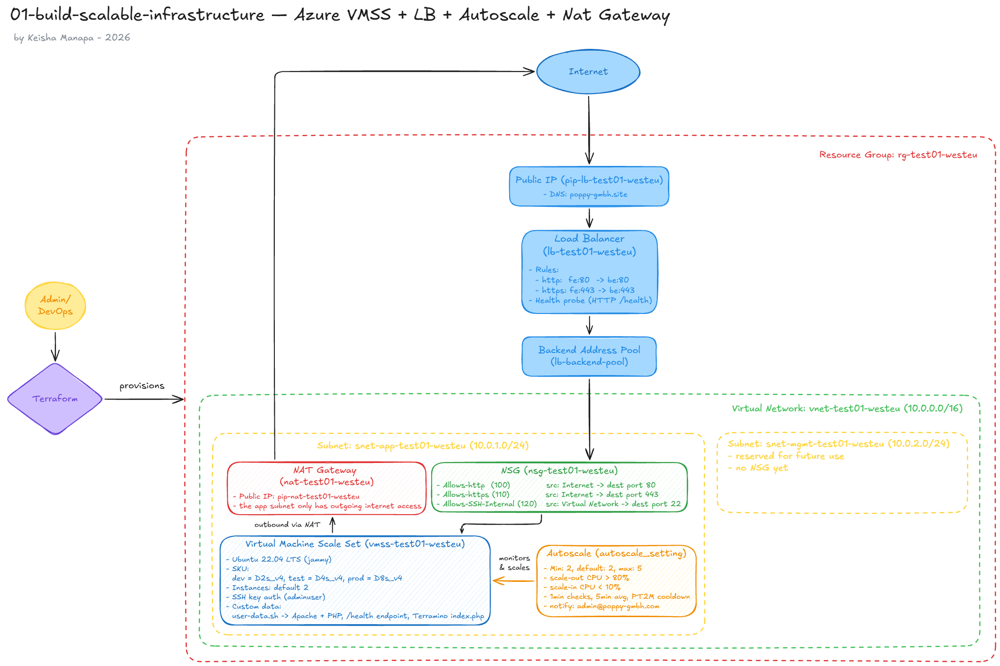
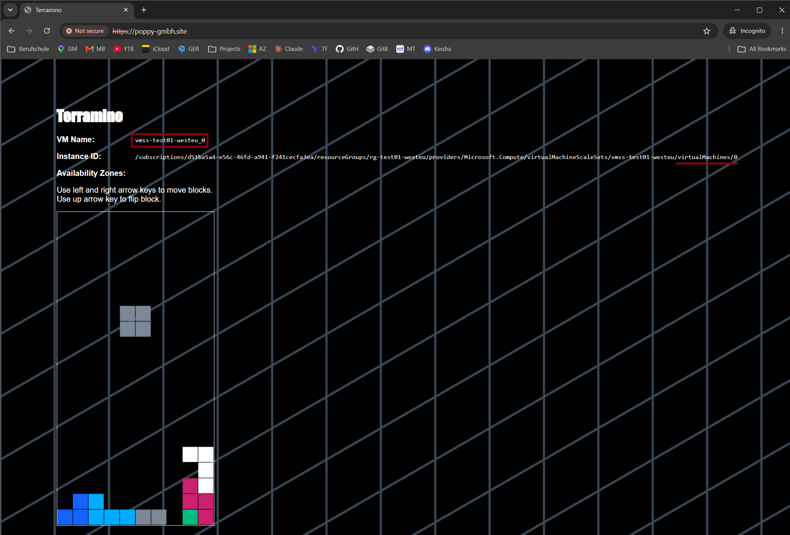
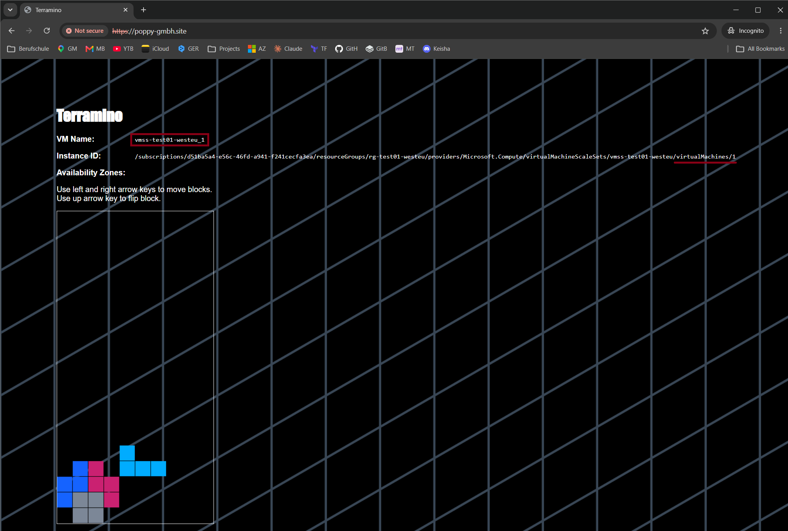

# Introduction

In this project, I will demonstrate a scalable Azure cloud infrastructure using Terraform that provides redundancy and improved performance for applications that are typically distributed across multiple instances. This setup allows customer traffic to be automatically redirected to other available instances when performing maintenance or updates.

## Features

- VMSS: running Ubuntu 22.04, auto-scales based on CPU load
- VM size: picked automatically depending on environment (dev/test/prod)
- Load Balancer: spreads traffic across instances, only sends it to healthy ones
- NSG: only lets the load balancer talk to the VMs, everything else is blocked
- NAT Gateway: gives the VMs internet access without exposing them publicly
- Each VM runs a fun demo app (Terramino) so you can actually see if the load balancer is working
- HTTPS: self-signed cert generated via Terraform's `tls` provider, served on port 443

## Architecture Diagram


## Challenges & How I Resolved Them

### 1. Implementing the region validation rule

While implementing the region validation rule, I ran into two mistakes that caused the validation to not work as expected:

- **Selecting a region by list index instead of an explicit variable:**

  I initially picked the deployment region based on its position in a list instead of by name. It worked, but if I ever reordered the list, my deployment region would quietly change without any warning.

  ```hcl
  resource "azurerm_resource_group" "rg" {
    name     = "rg-${var.resource_naming}"
    location = var.allowed_regions[1]
  }

  variable "allowed_regions" {
    type = list()
    default = ["EastUS", "WestEU", "SoutheastAsia"]
  }
  ```

  While fixing this, I also found two smaller mistakes in the same code. I realized that `list()` isn’t a valid type on its own. Terraform needs to know what’s inside the list, so it should be `list(string)`. The other issue was that Azure expects `"westeurope"` (lowercase, no spaces). 

  So the fix was adding a dedicated `location` variable that names the selected region directly instead of indexing into the list, plus correcting the type and the region name:

  ```hcl
  resource "azurerm_resource_group" "rg" {
    name     = "rg-${var.resource_naming}"
    location = var.location
  }

  variable "allowed_regions" {
    type = list(string)
    default = ["eastus", "westeurope", "southeastasia"]
  }

  variable "location" {
    type = string
    default = "westeurope"
  }
  ```

- **A validation rule that checked the list against itself:**

  ```hcl
  variable "allowed_regions" {
    type = list()
    default = ["EastUS", "WestEU", "SoutheastAsia"]

    # Rule that restrict other regions
    validation {
      condition = alltrue([for region in var.allowed_regions : contains(["EastUS", "WestEU", "SoutheastAsia"], region)])
      error_message = "The region must be one of the allowed regions: ${var.allowed_regions}"
    }
  }
  ```

  There were two problems here. First, the `condition` checked `allowed_regions` against a copy of itself, so it could never actually fail. It wasn’t validating a selected region at all. Second, the `error_message` tried to drop `var.allowed_regions` (a `list(string)`) directly into a string, which Terraform can’t handle because plugging a value into a string (Interpolation) only works with a single string, not a list.

  The fix was to separate "the list of allowed regions" from "the selected region" by introducing a new `location` variable. I also used `join()` to turn the list into a proper string for the error message:

  ```hcl
  variable "allowed_regions" {
    type = list(string)
    default = ["eastus", "westeurope", "southeastasia"]
  }

  variable "location" {
    type    = string
    default = "westeurope"

    validation {
      condition     = contains(var.allowed_regions, var.location)
      error_message = "The location must be one of the allowed regions: ${join(", ", var.allowed_regions)}"
    }
  }
  ```

### 2. Setting up the VMSS 

- **Indexing into an inline `subnet` block:**

  I tried to reference my app subnet by index, but `subnet` inside `azurerm_virtual_network` is a **set**, not a **list**. Sets have no order, so there’s no “first” item.

  ```hcl
  resource "azurerm_virtual_network" "vnet" {
  ...

    subnet {
      # Application subnet for the VMSS instances
      name             = "snet-app-${var.resource_naming}"
      address_prefixes = ["10.0.1.0/24"]
    }

    subnet {
      # Management subnet for the future use
      name             = "snet-mgmt-${var.resource_naming}"
      address_prefixes = ["10.0.2.0/24"]
      #security_group   = azurerm_network_security_group.vnet.id
    }
  }
  ```
  ```hcl
  resource "azurerm_linux_virtual_machine_scale_set" "vmss" {
    ...

    subnet_id = azurerm_virtual_network.vnet.subnet[0].id
  }
  ```

  > In the `azurerm_virtual_network resource`, the subnet argument is an inline repeatable block, and the AzureRM provider defines that block's type internally as a `TypeSet` rather than a `TypeList`. Set is unorrdered, so it protect you from accidental full replacement just because you moved a block around.

  To fix this, I switched from inline `subnet { }` blocks to standalone `azurerm_subnet` resources, This way, each subnet can be referenced directly by name instead of by position:

  ```hcl
  resource "azurerm_subnet" "app" {
    name                 = "snet-app-${var.resource_naming}"
    resource_group_name  = azurerm_resource_group.rg.name
    virtual_network_name = azurerm_virtual_network.vnet.name
    address_prefixes     = ["10.0.1.0/24"]
  }

  resource "azurerm_subnet" "mgmt" {
    ...
  }
  ```
  ```hcl
  resource "azurerm_linux_virtual_machine_scale_set" "vmss" {
  ...

    subnet_id = azurerm_subnet.app.id
  }
  ```

- **Missing SSH key for VMSS admin access:**

  `admin_ssh_key` needs a public key to install on the VM instances, but I didn't have an SSH key pair generated yet. The fix was generating a new SSH key pair:

  ```bash
  ssh-keygen -t rsa -b 4096 -f ~/.ssh/id_rsa
  ```

  Then pointing `file()` at the public key:

  ```hcl
  public_key = file("~/.ssh/id_rsa.pub")
  ```

  > `file()` is a Terraform function that reads a file's contents from your computer and returns it as a string, so you can use that content directly in your configuration.

- **Indexing into a nested block output:**

  I tried to grab a specific field from `source_image_reference` using `[0]`, but it's a single nested block, not a list, so it can't be indexed.

  ```hcl
  source_image_reference {
    publisher = "Canonical"
    offer     = "0001-com-ubuntu-server-jammy"
    sku       = "22_04-lts"
    version   = "latest"
  }
  ```
  ```hcl
  output "vmss" {
    value = [
      azurerm_linux_virtual_machine_scale_set.vmss.name,
      azurerm_linux_virtual_machine_scale_set.vmss.source_image_reference[0]
    ]
  }
  ```

  The fix was referencing it directly as an object instead of indexing into it:

  ```hcl
  output "vmss" {
    value = {
      name  = azurerm_linux_virtual_machine_scale_set.vmss.name
      image = azurerm_linux_virtual_machine_scale_set.vmss.source_image_reference
    }
  }
  ```

- **Indexing into a set attribute:**

  Now for this one, I tried to grab the VNet's address space with `[0]`, but `address_space` is a set, not a list. Sets have no order, so indexing isn't allowed.

  ```hcl
  resource "azurerm_virtual_network" "vnet" {
    name                = "vnet-${var.resource_naming}"
    address_space       = ["10.0.0.0/16"]
  }
  ```
  ```hcl
  output "vnet_name" {
    value = {
      name          = azurerm_virtual_network.vnet.name
      address_space = azurerm_virtual_network.vnet.address_space[0]
    }
  }
  ```

  The fix was converting the set to a list first with `tolist()`, and then indexing it:

  ```hcl
  output "vnet_name" {
    value = {
      name          = azurerm_virtual_network.vnet.name
      address_space = tolist(azurerm_virtual_network.vnet.address_space)[0]
    }
  }
  ```
  
  > Note: `address_prefixes` (subnet) and `address_space` (VNet) look like they should behave the same way, but they don't — `address_prefixes` is a `list(string)` (indexable), while `address_space` is a `set(string)` (not indexable).

  ```hcl
  output "subnets" {
    value = {
      Application_subnet = azurerm_subnet.app.address_prefixes[0]
      Management_subnet  = azurerm_subnet.mgmt.address_prefixes[0]
    }
  }
  ```

### 3. Clients couldn't reach Terramino app

I've double-checked that everything was deployed correctly. The resource group, NSG, load balancer rules, and backend pool all looked good in the Portal, and the health probes showed all instances as healthy. The infrastructure looked completely fine, but visiting the site still failed. Turns out, my NSG was only allowing the health probe, not traffic from the Internet:

  I set my NSG to only allow traffic from `"AzureLoadBalancer"`, assuming that would let everything passing through the load balancer. But it turns out this only allows the health probe, not internet traffic. Clients hit the VM with their own IP addresses, so their requests weren’t allowed through and got blocked by the default deny rule: 
  
```hcl
source_address_prefix = "AzureLoadBalancer"   
```

  I fixed this by switching to `"Internet"`:

```hcl
 source_address_prefix = "Internet"  
```

### 4. Mixing up the Azure DNS label with my own domain

At first I set `domain_name_label` to my actual domain (`poppy-gmbh.site`) from GoDaddy, but it failed. 

```hcl
resource "azurerm_public_ip" "lb_publicIP" {
  name                = "pip-lb-${var.resource_naming}"
  location            = azurerm_resource_group.rg.location
  resource_group_name = azurerm_resource_group.rg.name
  allocation_method   = "Static"
  sku                 = "Standard"
  domain_name_label   = "poppy-gmbh.site"   
}
```
> Note: This field only accepts letters, numbers, hyphens, dots are not allowed. It's specifically built for Azure's own free DNS name (`<label>.<region>.cloudapp.azure.com`), so not a real domain.

  Since I'm routing my own domain to the public IP directly through an A record in GoDaddy, I didn't actually need Azure's built-in DNS name at all, so the fix was just removing `domain_name_label` entirely:

```hcl
resource "azurerm_public_ip" "lb_publicIP" {
  name                = "pip-lb-${var.resource_naming}"
  location            = azurerm_resource_group.rg.location
  resource_group_name = azurerm_resource_group.rg.name
  allocation_method   = "Static"
  sku                 = "Standard"
}
```

### 5. Terramino wasn't loading by default

Even after fixing DNS and the NSG, visiting `poppy-gmbh.site` will only show raw instance metadata instead of the Terramino game. Clients had to manually add `/index.php` to see it. This is happening because Apache's default `DirectoryIndex` checks for `index.html` before `index.php`. Since `user-data.sh` creates both files in the web root, Apache was always serving the metadata dump first.

```
both files exist in /var/www/html:
- index.html  <- served first by default
- index.php   <- the actual Terramino game
```

- `/var/www/html` — is a folder path on the VM, the actual physical location where your website's files live.
- `DirectoryIndex` — it doesn't live "inside" a folder. It's an Apache configuration setting; a rule that tells Apache: "when someone visits a folder (like your website's root /) without specifying an exact filename, which file should you show them by default?". 

The fix was simple, just telling Apache to prioritize `index.php` over `index.html` by adding a new `DirectoryIndex` directive to the Apache config:

```bash
#!/bin/bash
apt-get update -y
apt-get install -y apache2 php php-curl libapache2-mod-php php-mysql jq

# --- Make Apache serve index.php before index.html at the root URL ---
echo "DirectoryIndex index.php index.html" | sudo tee /etc/apache2/mods-enabled/dir.conf
```

Breaking it into pieces:
- `echo` "DirectoryIndex index.php index.html" — creates the text you want to write: the instruction "check for index.php first, then index.html."
- `|` — a pipe, meaning "take the output of the left side and feed it into the right side."
- `sudo tee /etc/apache2/mods-enabled/dir.conf` — `tee` writes that text into the file dir.conf (this is the actual Apache config file that holds the DirectoryIndex rule). `sudo` is needed because this file requires admin/root permission to edit. `tee` is used instead of a simple `>` redirect because sudo alone doesn't apply to redirects properly in bash. `tee` lets sudo apply to the writing action itself.

### 6. Health probe marked instances unhealthy after adding HTTPS

After setting up HTTPS with a self-signed cert (via Terraform's `tls` provider) and configuring Apache to redirect all HTTP traffic to HTTPS, my health probe was still checking the old HTTP endpoint:

```hcl
resource "azurerm_lb_probe" "lb_probe" {
  loadbalancer_id = azurerm_lb.loadbalancer.id
  name            = "health-probe"
  protocol        = "Http"
  port            = 80
  request_path    = "/health"
}
```

Since every request to port 80 now gets redirected (`301`/`302`) to HTTPS, the probe never received the `200 OK` it was expecting from `/health`. Azure Load Balancer doesn't follow redirects, so it treats any non-`200` response as unhealthy, meaning my instances could silently start failing health checks even though the app itself was working fine.

The load balancer rule for port 80 (`fe:80 -> be:80`) still needs to exist, since it's what lets the initial HTTP request reach Apache in order to be redirected in the first place. The issue was isolated entirely to the probe, which is a separate resource from the LB rules and just happens to be referenced by both of them via `probe_id`.

The fix was pointing the probe at the HTTPS endpoint instead:

```hcl
resource "azurerm_lb_probe" "lb_probe" {
  loadbalancer_id = azurerm_lb.loadbalancer.id
  name            = "health-probe"
  protocol        = "Https"
  port            = 443
  request_path    = "/health"
}
```

> Note: Azure LB health probes complete a TLS handshake but don't validate the certificate chain — no hostname check, no CA trust verification. So a self-signed cert doesn't cause the probe to fail, even though a browser would normally flag it as untrusted.

## Demo


